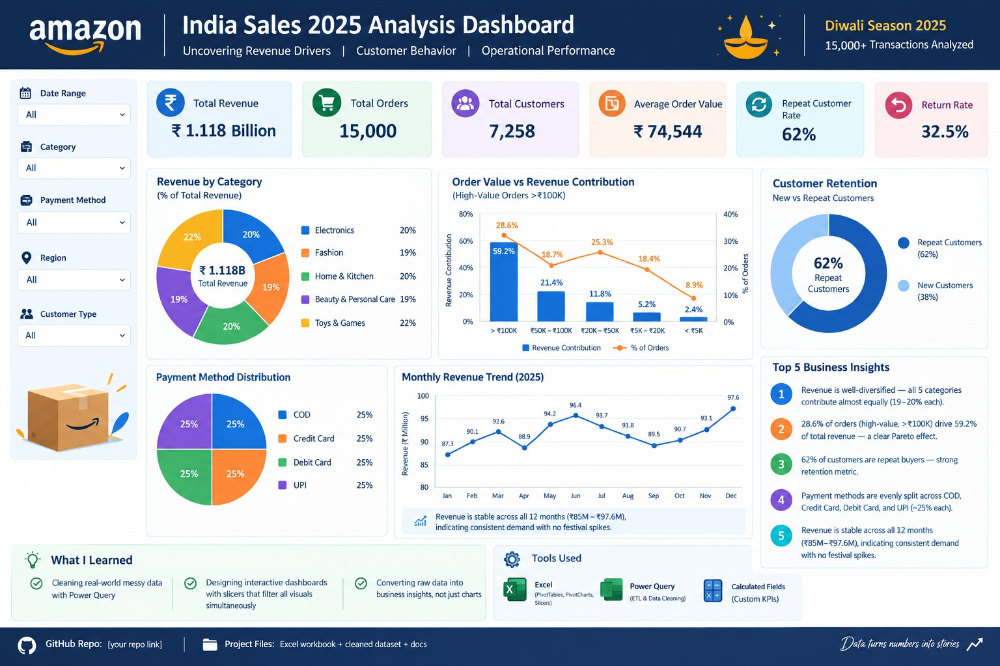

# Amazon Sales 2025 — Data Analyst Project

End-to-end **Excel + Power Query** analysis of **15,000 Amazon India sales transactions** during the **2025 Diwali season**, with an interactive dashboard and 10 business insights.

---

## 📌 Project Overview

This project analyzes a full year of Amazon India e-commerce transactions (Jan–Dec 2025) to uncover revenue drivers, customer behavior, geographic patterns, and operational performance.

**Goal:** Build a clean, interactive dashboard that answers 10 business questions using PivotTables, PivotCharts, and Power Query.

---

## 🛠️ Tools Used

- **Microsoft Excel** — PivotTables, PivotCharts, Slicers, KPI cards
- **Power Query** — data import, cleaning, transformation
- **DAX-style calculated fields** — AOV, % share, return rate

---

## 📂 Dataset

- **Source:** Synthetic Amazon India sales data (2025)
- **Rows:** 15,000 transactions
- **Columns:** 15 (Order_ID, Date, Customer_ID, Product, Category, Quantity, Price, Revenue, Payment, Delivery, Rating, Review, State)
- **Region:** India
- **Period:** January 2025 – December 2025

---

## 🧹 Data Cleaning (Power Query)

| Step | Action |
|---|---|
| 1 | Promoted headers |
| 2 | Set correct data types (Date, Number, Text) |
| 3 | Removed `Country` column (all India) |
| 4 | Trimmed and cleaned all text fields |
| 5 | Added `Order_Year`, `Order_Month_Num`, `Order_Month_Name`, `Order_Quarter` |
| 6 | Added `High_Value_Order` flag (>₹100K) |
| 7 | Validated `Total_Sales_INR = Quantity × Unit_Price_INR` — no mismatches |

---

## 📊 Key KPIs

| Metric | Value |
|---|---|
| **Total Revenue** | ₹1,118,161,804 |
| **Total Orders** | 15,000 |
| **Total Customers** | 7,258 |
| **Average Order Value (AOV)** | ₹74,544 |
| **Repeat Customer Rate** | 62% |
| **Return Rate** | 32.5% |
| **Average Rating** | 3.00 |

---

## 📈 Dashboard

**Features:**
- 6 KPI cards (Revenue, Orders, AOV, Repeat %, Return %, Rating)
- Monthly revenue trend (line chart)
- Revenue by category (bar)
- Top 5 states by revenue (bar)
- Payment method split (pie)
- Delivery status split (pie)
- Interactive slicers (Category, State, Payment, Delivery)

---

## 🔍 10 Business Questions Answered

1. Which product category generates the highest revenue?
2. How does monthly revenue trend across 2025?
3. Which are the top 10 products by revenue?
4. Which states contribute the most revenue?
5. What is the delivery outcome split and return rate by category?
6. Which payment method is most used, and how does AOV vary by method?
7. What is the AOV overall, by category, and by state?
8. What is the average rating by category?
9. How do high-value orders (>₹100K) behave?
10. What is the repeat customer rate and revenue contribution?

---

## 💡 Top 8 Insights

1. **Well-diversified portfolio:** All 5 categories contribute almost equally (19.4%–20.3% of revenue). Beauty leads at 20.34%.

2. **Stable revenue:** Monthly revenue stayed within a tight band (₹85M–₹97.6M). Feb was lowest (−7.67% MoM); Aug and Dec were peaks.

3. **Top 10 products = ~41% of revenue** — no single product dominates; the top product contributes ~4.3%.

4. **Geographic balance:** Top 5 states (Sikkim, Rajasthan, Chhattisgarh, Meghalaya, Tamil Nadu) together contribute ~19% of revenue — remarkable geographic spread across India.

5. **Payment parity:** Cash on Delivery, Credit Card, Debit Card, and UPI each handle ~25% of orders. AOV is nearly identical across methods (~₹73K–₹75K).

6. **Pareto effect on order value:** 28.6% of orders (high-value, >₹100K) generate **59.2% of total revenue**.

7. **Strong retention:** 62% of customers placed more than one order. 38% buy once, 33% buy twice, and 29% buy 3+ times.

8. **Uniform ratings:** Average rating is ~3.00 across every category — returned orders show the same rating as delivered ones.

---

## 🎯 Business Recommendations

- **Retention over acquisition:** 62% repeat rate is strong; invest in loyalty programs for the 3+ order cohort.
- **Focus on high-value customers:** 28% of orders → 59% of revenue. Losing them would devastate revenue.
- **Reduce return rate (32.5%):** Investigate logistics and product quality, especially for Books (highest at ~33.9%).
- **Expand digital payments:** COD still holds ~25% share; push UPI/Credit Card offers to reduce cash handling.
- **Geographic growth:** Tier-2/3 states perform on par with metros — invest in regional logistics.

---

